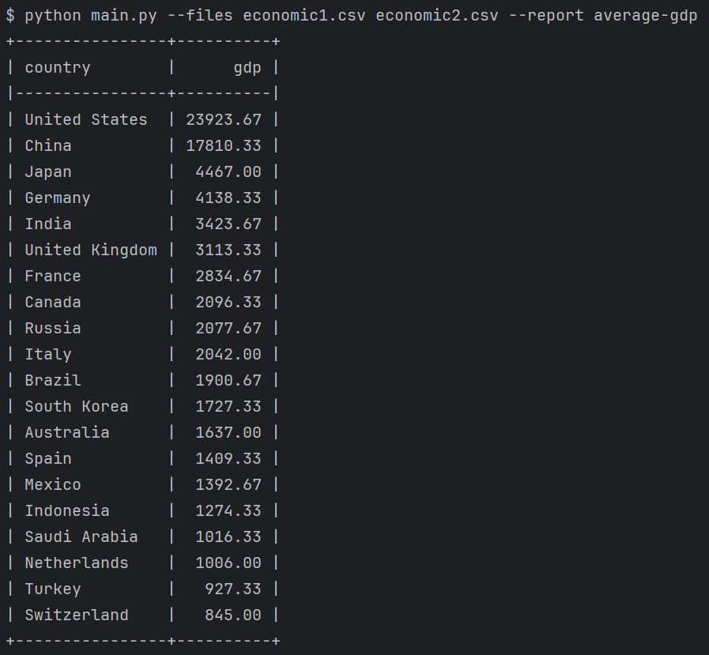
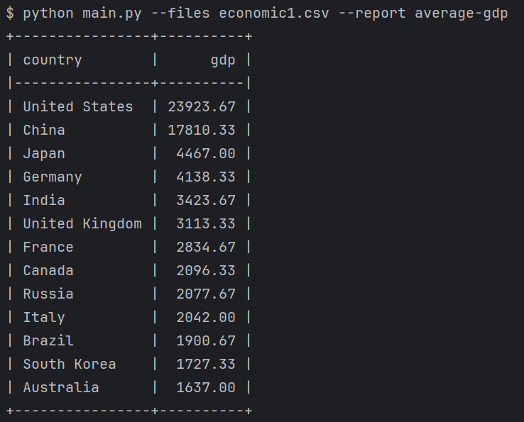
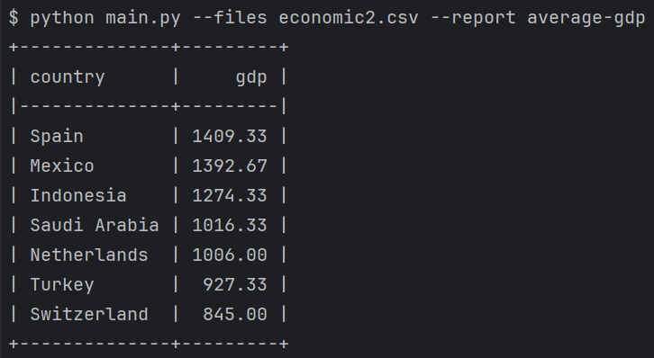
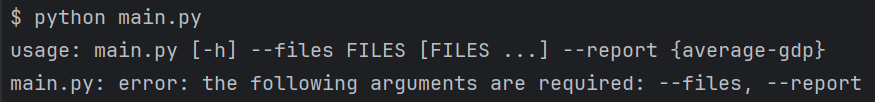
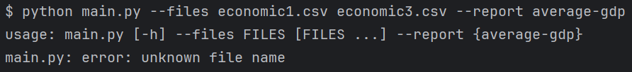
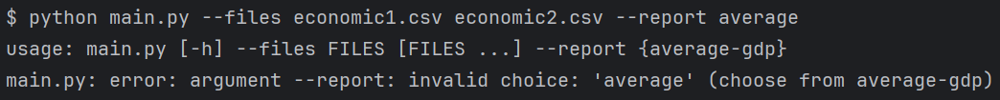

# Тестовое задание для StafIT.
## Скрипт для обработки csv-файла
### Запуск
Исходные файлы должны лежать в директории ```csv_files/```.
```bash
python main.py --files dataset1.csv dataset2.csv --report average-gdp
```
### Добавление нового отчёта
- Создать файл в директории ```reports/```, например ```unemployment_changed.py```.
- Зарегистрировать функцию через декоратор:
```bash
from reports.loader import register

@register("unemployment-changed")
def unemployment_changed(rows: list[dict]]) -> list[dict]:
    ...
```
Готово, отчёт можно использовать в скрипте.  
Важно! Подразумевается одинаковое именование названия отчёта и соответствующей функции с разницей только в разделителе: для наименования отчёта "-", для функции "_" (см. пример выше).
### Примеры запуска
Два файла  
  
Только первый файл  
  
Только второй файл  
  
Без аргументов  
  
Неправильное название файла  
  
Неправильное название отчёта  
  
